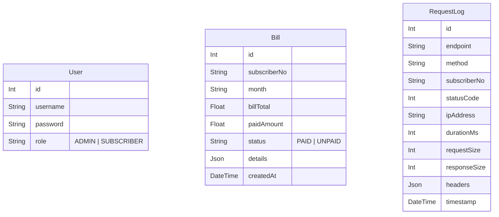

# SE 4458 - Mobile Provider Bill Payment System

### Ahmet Kemal Biliciler 21070006001

This project is a RESTful API developed for the SE 4458 Software Architecture & Design of Modern Large Scale Systems course. It simulates a backend system for a mobile provider, handling bill inquiries, payments, and admin operations through various client channels (Mobile App, Banking App, Web Site).

## 🔗 Project Links

- **Source Code:** https://github.com/ahmetkemalbiliciler/Midterm4458
- **Project Video Presentation:** https://drive.google.com/file/d/15e3jJ79y-ED56486MOaecb98_XDKT_V9/view?usp=sharing
- **Live Demo (Swagger):** https://midterm4458.onrender.com/api-docs/

---

## 🏗️ Software Architecture & Design

### 1. Architectural Pattern: Gateway Pattern (Monolithic)

Although the project is deployed as a single unit (Monolithic), it strictly implements the **API Gateway Pattern** logically.

- **Gateway Layer (`src/middlewares/apiGateway.ts`):** All incoming traffic is intercepted here. It acts as a single entry point managing:
  - **Rate Limiting:** Enforces the "3 calls per day" rule for specific endpoints.
  - **Logging:** Captures detailed request/response metrics (Latency, Size, IP, Status) as per requirements.
  - **Authentication:** Validates JWT tokens before requests reach the business logic.
- **Service Layer:** Contains business logic and database interactions (Clean Architecture).
- **Controller Layer:** Handles HTTP requests and responses.

### 2. Tech Stack

- **Runtime:** Node.js
- **Framework:** Express.js (TypeScript)
- **Database:** PostgreSQL(Prisma Postgres)
- **ORM:** Prisma
- **Documentation:** Swagger (OpenAPI 3.0)
- **Deployment:** Render.com

---

## 🗂️ Data Model

The system uses a relational database model managed by Prisma.

- **Bill:** Stores billing information.
- **User:** Stores authentication credentials (for Admin/Banking apps).
- **RequestLog:** Stores all traffic logs required for auditing and rate limiting.

## 💭 Assumptions

During the development, the following assumptions were made based on the project PDF:

Authentication Flow: The PDF states "Authentication: YES" for certain endpoints but does not define a Login API. A /api/v1/auth/login endpoint was created to generate JWT tokens to satisfy this technical requirement.

## ⚠️ Issues Encountered & Solutions

### 1. Gateway Rate Logic Overlap

Issue: The initial Rate Limit logic used req.path.includes('/query-bill'), which unintentionally blocked /query-bill-detailed requests as well.

Solution: Logic was refined to explicitly exclude paths containing "detailed" (!req.originalUrl.includes('detailed')) within the Gateway middleware.

### 2. Swagger Fetch Error on Deployment

Issue: Swagger UI was trying to fetch data from localhost after deployment.

Solution: The Swagger configuration was updated to use a relative path (/api/v1) instead of a hardcoded URL, allowing it to work seamlessly on both local and production environments.

## 🧪 API Endpoints Overview

| Channel   | Endpoint                           | Method | Auth | Description          |
| --------- | ---------------------------------- | ------ | ---- | -------------------- |
| Auth      | /api/v1/auth/login                 | POST   | NO   | Get JWT Token        |
| Mobile    | /api/v1/mobile/query-bill          | POST   | YES  | Rate limited (3/day) |
| Mobile    | /api/v1/mobile/query-bill-detailed | POST   | YES  | Paging supported     |
| Bank      | /api/v1/bank/query-bill            | POST   | YES  | List unpaid bills    |
| Web       | /api/v1/web/pay-bill               | POST   | NO   | Mark bill as paid    |
| Web/Admin | /api/v1/web/admin/add-bill         | POST   | YES  | Create single bill   |
| Web/Admin | /api/v1/web/admin/batch-upload     | POST   | YES  | Upload CSV           |
